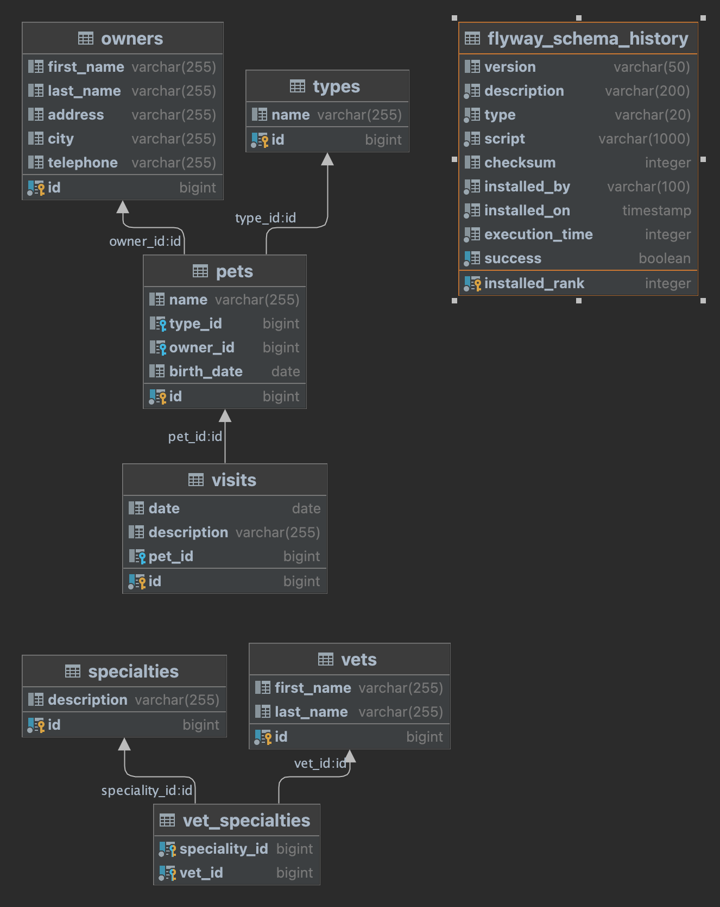

## Pet Clinic V2

===================

Spring Pet Clinic using Spring-Boot, Thymeleaf, AOP, MVC, JPA, Hibernate, Flyway, Docker and more.

## Technology stack

- Spring Boot
- PostgreSQL 15
- Hibernate
- Flyway
- Docker
- Thymeleaf

## Spring Features
- Spring Web
- Spring MVC
- Spring JPA
- Spring AOP

## To run this application
To get started, you need a database. Docker will help us with this. It needs to be installed locally.

### Start with Docker-compose
#### To ```start``` docker-compose use:
> docker-compose -f docker/docker-compose.yml up

#### To ```stop``` docker-compose use: 
> docker-compose -f docker/docker-compose.yml down

### Manual start db with Docker 
First step. Run the command in the terminal:
> docker pull postgres:latest

> docker run --name dev-postgres -p 5432:5432 -e POSTGRES_PASSWORD=postgres -d postgres:latest

NOTE: The first line pulls PostgreSQL `latest` version;
the second line initiates a new instance of it with the name `dev-postgres`, running on port `5432`.

Next step, create a working database

> docker exec dev-postgres psql -U postgres -c "CREATE DATABASE clinic" postgres

This line executes a DDL command to create the database `clinic` into the instance.

_Keep in mind, you are not creating a volume for the storage data if the container is deleted, all its data will be deleted as well._

## DataBase ERM Diagram


## HTTP POST vs. PUT
Coming soon ...

### Spring Boot Auditing
Coming soon ...

### "Whitelabel" Error Page

Ensure error handling is happening properly.
